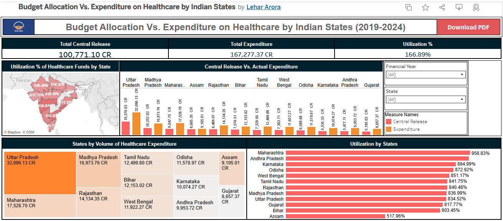

# 📊 Budget Allocation vs. Expenditure on Healthcare by Indian States (2019–2024)

## 🔍 Objective
This project analyzes how Indian states have utilized centrally released healthcare funds from 2019–20 to 2023–24. It highlights disparities between allocated budgets and actual expenditures to assess efficiency in fund utilization across states.

---

## 📁 Dataset

- **Source**: Government of India via Sansad (Parliament website)  
- **Financial Years Covered**: 2019‑20, 2020‑21, 2021‑22, 2022‑23, 2023‑24  
- **Fields**:  
  `State` | `Financial Year` | `Central Release (₹ Crores)` | `Expenditure (₹ Crores)`

---

## 📈 Dashboard (Tableau Public)

[🔗 View the Interactive Dashboard on Tableau Public](https://public.tableau.com/views/BudgetAllocationVs_ExpenditureonHealthcarebyIndianStates/BudgetAllocationVs_ExpenditureonHealthcarebyIndianStates2019-2024?:language=en-GB&publish=yes&:sid=&:redirect=auth&:display_count=n&:origin=viz_share_link)

---

## 💡 Key Insights

- Many states spent **less** than the central funds released to them, indicating underutilization.
- States like **Bihar, Maharashtra, and Uttar Pradesh** frequently overspent their releases, suggesting demand-driven excess expenditure.
- **Union Territories** such as **Lakshadweep** and **Dadra & Nagar Haveli** had minimal variances between allocation and spend.
- **Large states** (e.g. Andhra Pradesh and Uttar Pradesh) showed significant **year-on-year volatility in allocations**.
- Fiscal year **2021‑22** saw sharp spikes in releases likely due to COVID‑19 stimulus, but spending efficiency varied.

---

## 🧰 Tools Used

- **Tableau Public** for interactive visualizations  
- **Excel / CSV** spreadsheets for cleaning and structuring the data

---

## 👤 Author

Lehar Arora  
📧 lehararora666@gmail.com  

